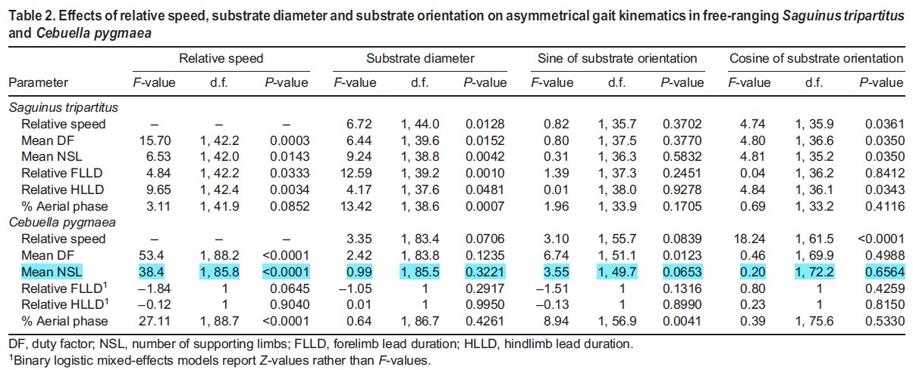
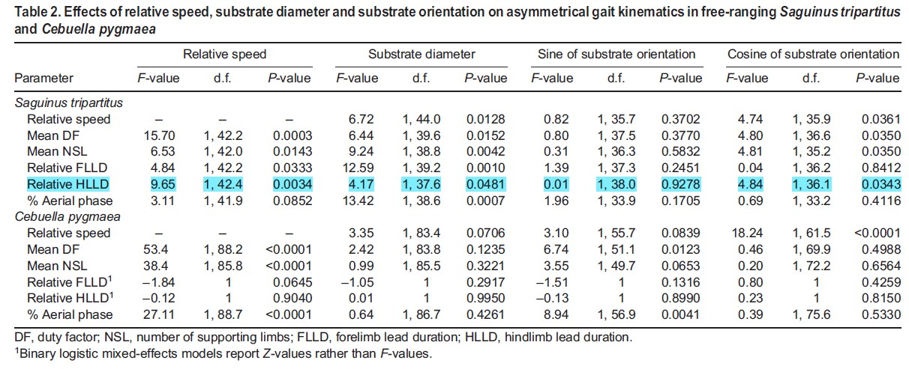
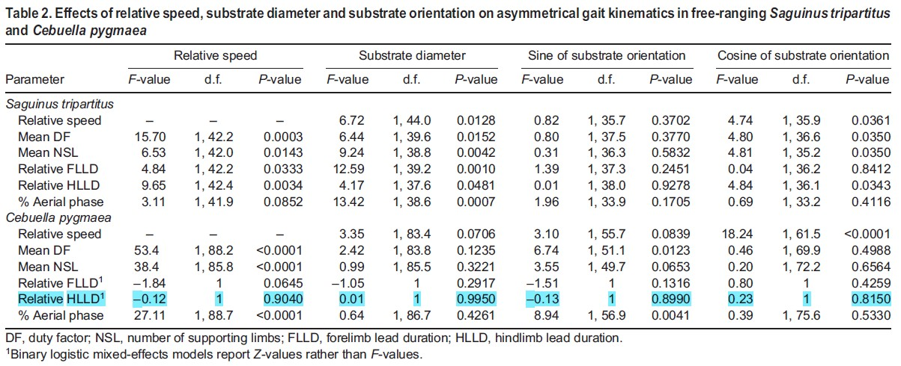

## Packages Used
{tidyverse},{dplyr},{mosaic},{tidylog},{readxl},{ggplot2},{formatR},{knitr},{kableExtra},{cowplot|,{lme4},{lmerTest},{Matrix}

```{r, message = FALSE, warning = FALSE}

knitr::opts_chunk$set(fig.path = "images/") #Output folder for all of my figures

library(tidyverse)
library(dplyr)
library(mosaic)
library(tidylog)
library(readxl)
library(ggplot2)
library(formatR)
library(knitr)
library(kableExtra)
library(cowplot)
library(lme4)
library(lmerTest)
library(Matrix) 
#NOTE: The installed versions of {Matrix} and {lme4} must be compatible binaries.
#I resolved this by uninstalling {Matrix}, {lmer4}, and {lmerTest}, and then reinstalling each following the cited *Stack Overflow* page's method:

#oo <- options(repos = "https://cran.r-project.org/")
#install.packages("Matrix")
#install.packages("lme4")
#install.packages("lmerTest")
#options(oo)

#I am commenting this here as opposed to including the above in my code to avoid having a package installation in my code
```

## Introduction to Dunham *et al.* (2020a)

### Summary

### Methods

#### Data Collection

#### Variable Names

#### Analysis

### Results

### Conclusions


## My Project Outline

### Descriptive Statistics

For my descriptive statistics, I will be attempting to replicate Dunham *et al.* (2020a) Table 1, which summarizes the "number of strides for different substrate diameter and orientation categories in free-ranging *Saguinus tripartitus* and *Cebuella pygmaea*" (p. 4).

### Inferential Statistics

For my inferential statistical analysis, I will be attempting to replicate the linear mixed regression analysis that Dunham *et al.* (2020a) used to evaluate the "effects of substrate
diameter and substrate orientation on continuous kinematic variables," including relative speed, mean duty factor, mean number of supporting limbs, relative forelimb lead duration, relative hindlimb lead duration, and percent aerial phase (p. 4). Dunham *et al.* (2020a) also used binary logistic mixed-effects models for two models because the residual error for these two models was not normally distributed, meaning that they did not "satisfy assumptions of linear mixed regression analysis" (p. 4). Thus, for these models, I will be attempting to replicate the binary logistic mixed-effects regression anaalysis used by Dunham *et al.* (2020a). 

### Visualization

For my visualization, I will be attempting to replicate Dunham *et al.* (2020a) Figure 3 (p. 7), which consists of plots of various kinematic variables (mean duty factor, mean number of supporting limbs, relative forelimb lead duration, relative hindlimb lead duration, and percent aerial phase) regressed against relative speed for *Saguinus tripartitus* and *Cebuella pygmaea*.


## Exploratory Data Analysis

Here, I'm loading the dataset from Dunham *et al*. (2020).
```{r}
f <- "data/Dunham et al. (2020) dataset.xlsx"
d <- read_excel(f,sheet = 1, col_names = TRUE)
```

```{r, echo = TRUE}
(head(d)) #For a view of the first few lines of the data set
```

```{r, warning = FALSE}
#Some variables that should be numeric were read in as character variables, so I needed to correct this

class(d$relBrnchDiamNsTl) #Checking; relBrnchDiamNsTl is already numeric
class(d$Sin_SbstOrient) #Checking
d$Sin_SbstOrient <- as.numeric(d$Sin_SbstOrient) #Changing Sin_SbstOrient to numeric
class(d$Cos_SbstOrient) #Checking
d$Cos_SbstOrient <- as.numeric(d$Cos_SbstOrient) #Changing Cos_SbstOrient to numeric
class(d$relSpeed)#Checking; relSpeed is already numeric
class(d$Meandf)#Checking; Meandf is already numeric
class(d$MeanNSL) #Checking; MeanNSL is already numeric
class(d$relFLldMS) #Checking
d$relFLldMS <- as.numeric(d$relFLldMS) #Changing relFLldMS to numeric
class(d$relHLldMS) #Checking
d$relHLldMS <- as.numeric(d$relHLldMS) #Changing relHLldMS to numeric
class(d$PercAerial) #Checking; PercAerial is already numeric
class(d$MeanLphsMS) #Checking
d$MeanLphsMS <- as.numeric(d$MeanLphsMS) #Changing MeanLphsMS to numeric
class(d$SubstrateDisp) #Checking
d$SubstrateDisp <- as.numeric(d$SubstrateDisp) #Changing SubstrateDisp to numeric
```

Various kinematic and substrate variables and were calculated by Dunham *et al*. (2020) from the data available in their published dataset (pp. 3-4). 

The variable relative branch diameter (**relBrnchDiamNsTl**) is a ratio of the branch diameter relative to primate body length measure from nose to base of tail (Dunham *et al*., 2020a). Dunham *et al*. (2020a) used these relative branch diameter ratios to group substrate into three size categories: small ("less than half of an individual’s trunk diameter"), medium ("between half and equal to an individual’s trunk diameter"), and large ("greater than an individual’s trunk diameter") (p. 4). Here, I am adding a new variable to my dataset, **relBrnchDiamCategories**, to categorize substrate for each observation as described above.

Here are the levels in **relBrnchDiamCategories**:

```{r}
d <- d |> mutate(relBrnchDiamCategories = case_when( #Creating new variable categorizing relative substrate diameter
  relBrnchDiamNsTl >= 0.5 & relBrnchDiamNsTl <= 1 ~ "Medium",
  relBrnchDiamNsTl > 1 ~ "Large",
  relBrnchDiamNsTl < 0.5 ~ "Small",
  TRUE ~ NA
  ))
d$relBrnchDiamCategories <- as.factor(d$relBrnchDiamCategories) #As factor because this is a categorical variable with levels.
(levels(d$relBrnchDiamCategories))
```

The variables sine of substrate orientation angle (**Sin_SbstOrient**) and cosine of substrate orientation angle (**Cos_SbstOrient**) are transformations of the raw substrate orientation angle measurement in degrees (Dunham et al., 2020a, p. 4). Dunham *et al*. (2020a) used these to group substrate into three orientation categories: horizontal ("between -30 and 30 deg"), decline ("less than -30 deg"), and incline ("greater than 30 deg") (p. 4). Here, I am adding a new variable to my dataset, **SbstOrientCategories**, to categorize substrate for each observation as described above. The choice to use **Sin_SbstOrient** to calculate orientation angle is because, unlike **Cos_SbstOrient**, it can differentiate declines and inclines (Dunham *et al*., 2020a).

Here are the levels in **SbstOrientCategories**:
```{r}
d$Angle_SbstOrient <- (asin(d$Sin_SbstOrient))*(180/pi) #Converting sin to angle (deg)

d <- d |> mutate(SbstOrientCategories = case_when( #Creating new variable categorizing substrate orientation
  Angle_SbstOrient >= -30 & Angle_SbstOrient <= 30 ~ "Horizontal",
  Angle_SbstOrient < -30 ~ "Decline",
  Angle_SbstOrient > 30 ~ "Incline",
  TRUE ~ NA
  ))

d$SbstOrientCategories <- as.factor(d$SbstOrientCategories) #As factor because this is a categorical variable with levels.
d$SbstOrientCategories <- fct_relevel(d$SbstOrientCategories,"Horizontal","Incline","Decline") #Reordering the levels to later better replicate Table 1
(levels(d$SbstOrientCategories))
```

Because only Genus in included as a column in the published dataset, I decided to add columns both for species (**Species**) and binomial nomenclature (**Binomial**).

```{r}
d$Genus <- as.factor(d$Genus)

d <- d |> mutate(Species = case_when( #Creating new variable, Species
  Genus == "Cebuella" ~ "pygmaea",
  Genus == "Saguinus" ~ "tripartitus"
  ))
d <- d |> mutate(Binomial = paste(Genus, Species, sep = " ")) #Creating new variable, Binomial, by concatenating **Genus** and **Species** using paste()

d$Binomial <- as.factor(d$Binomial)
d$Binomial <- fct_relevel(d$Binomial,"Saguinus tripartitus","Cebuella pygmaea")
```

Dunham *et al*. (2020a) define the variables relative forelimb lead duration (**relFLldMS**) and relative hindlimb lead duration (**relHLldMS**) represent "the interval between touchdowns within a limb girdle divided by the total contact duration of the limb girdle" (p. 4). Dunham *et al*. (2020a) used these to differentiate symmetrical gaits ("temporal lag between the left and right limbs in each girdle amounted to 50±10% of stride duration") from asymmetrical gaits (values outside the symmetrical gait range) (p. 3). Within asymmetrical gaits, these variables were additionally used to differentiate bounds (both forelimb and hindlimb stance periods were nearly simultaneous), half-bounds (hindlimb stance periods were nearly simultaneous
but forelimb stance periods were staggered), and gallops (both forelimb and hindlimb stance periods were staggered) (p. 3).

Here, I am first adding two new columns to my dataset, **FL** and **HL**, to store whether forelimb touchdowns and hindlimb touchdowns, respectively, were simultaneous ("the interval between the trailing and leading limb mid-support was ≤10% of total limb pair contact duration") or staggered ("the interval between the trailing and leading limb mid-support was
≥10% of total limb pair contact duration") for each observation (Dunham *et al.*, 2020a, p. 3). Following from this, I am adding a new variable, **GaitType2**, which categorizes each observation as a symmetrical gait, a bound, a half-bound, or a gallop (p. 3).

```{r Gait Type}
d <- d |> #Categorizing forelimb stance periods as nearly simultaneous or staggered based on relative forelimb lead duration, relFLldMS
  mutate(FL = case_when(
    relFLldMS <= 0.1 ~ "simultaneous",
    relFLldMS > 0.1 ~ "staggered"
  ))
d <- d |> #Categorizing hindlimb stance periods as nearly simultaneous or staggered based on relative hindlimb lead duration, relHLldMS
  mutate(HL = case_when(
    relHLldMS <= 0.1 ~ "simultaneous",
    relHLldMS > 0.1 ~ "staggered"
  ))

d <- d |> mutate(GaitType2 = case_when( #Categorizing gait types based on both forelimb and hindlimb stance periods
  `Gait Type` == "Sym" ~ "Symmetrical",
  FL == "simultaneous" & HL == "simultaneous" ~ "Bound",
  FL == "staggered" & HL == "simultaneous" ~ "Half-bound",
  FL == "staggered" & HL == "staggered" ~ "Gallop"
))

gait <- table(d$Binomial,d$GaitType2)
gaittable <- kable(gait, caption = "Number of strides for different gait types in free-ranging <i>Saguinus tripartitus</i> and <i>Cebuella pygmaea</i>")|> #Adding a title
        add_header_above(c(" " = 1, "Gait Type" = 4))|> #Adding subtitles over the specified groups of columns
        kable_styling(full_width = FALSE) |> #Fixing the spacing of the columns, which were crowded together without this specification
        row_spec(0, extra_css = "margin-bottom: 10px;") |> #Fixing the spacing of the rows, which were crowded together without this specification
        column_spec(1, italic = TRUE) #Italicizing the scientific names pulled from the variable Binomial

(gaittable)
```

## Descriptive Statistics

Here, I attempting to replicate **Table 1**, which summarizes the number of strides (n=209) for different substrate diameter (small, medium, large) and orientation categories (decline, horizontal, incline) in free-ranging *Saguinus tripartitus* (n=108) and *Cebuella pygmaea* (n=101) (p. 4). Dunham *et al*. (2020a) clarify that each observation in the dataset represents one stride (n = 209) (p. 3).

```{r}
tab1a <- table(d$Binomial,d$relBrnchDiamCategories) #Creating a table summarizing the frequency of each substrate diameter category across observations of Saguinus and Cebuella strides
```

```{r}
tab1b <- table(d$Binomial,d$SbstOrientCategories) #Creating a table summarizing the frequency of each substrate orientation category across observations of Saguinus and Cebuella strides
```

```{r Table 1 Replication}
tab1 <- cbind(tab1a,tab1b) #Combining the above two tables to more accurately replicate Table 1
tab1 <- kable(tab1, caption = "Table 1. Number of strides for different substrate diameter and orientation categories in free-ranging <i>Saguinus tripartitus</i> and <i>Cebuella pygmaea</i>")|> #Adding a title
        add_header_above(c(" " = 1, "Substrate diameter" = 3, "Substrate orientation" = 3))|> #Adding subtitles over the specified groups of columns
        kable_styling(full_width = FALSE) |> #Fixing the spacing of the columns, which were crowded together without this specification
        row_spec(0, extra_css = "margin-bottom: 10px;") |> #Fixing the spacing of the rows, which were crowded together without this specification
        column_spec(1, italic = TRUE) #Italicizing the scientific names pulled from the variable Binomial
(tab1)
```
Here is Table 1 for comparison (Dunham *et al*., 2020a, p.4):

```{r echo = FALSE, width = "800px"}
 #Embedding .jpg from folder in repo
```

My values for the number of strides observed for each substrate orientation category match exactly. However, looking instead at substrate diameter, while the stride numbers sum to the correct number of observations for *Saguinus tripartitus* (n=108) and *Cebuella pygmaea* (n=101), my distribution of strides across substrate diameter categories does not match Table 1 (Dunham *et al.*, 2020a). Dunham et al. (2020a) state that the variable relative branch diameter (**relBrnchDiamNsTl**) is a ratio of the branch diameter relative to primate body length measure from nose to base of tail (p. 4). Because a small substrate was defined as one "less than half of an individual’s trunk diameter," I assigned this category to observations where **relBrnchDiamNst** < 0.5 (Dunham *et al*., 2020a, p. 4). Because a medium substrate was defined as one "between half and equal to an individual’s trunk diameter," I assigned this category to observations where 0.5 >= **relBrnchDiamNst** <= 1 (Dunham *et al*., 2020a, p. 4). Lastly, because a large substrate was defined as one "between half and equal to an individual’s trunk diameter," I assigned this category to observations where **relBrnchDiamNst** > 1 (Dunham *et al*., 2020a, p. 4). Therefore, while I believe my assignment of these categories matches their presented definitions, there appears to be some discrepancy between how I assigned these categories and how they were assigned by Dunham *et al*. (2020a). One potential explanation is that **relBrnchDiamNst** in the published dataset is likely a Box–Cox transformed value, as other variables in the published dataset clearly are already transformed according to the methods outlined by Dunham *et al*.'s (2020a) in the "Statistical analyses" section (p. 4). I unfortunately cannot revert these values back to their raw values to test if this is the issue because the lambda value used as the transformation parameter is not specified. 


## Inferential Statistical Analysis

### Linear Mixed Models

Dunham *et al.* (2020a) ran linear mixed model regressions in order to evaluate the effects of substrate diameter and orientation on various kinematic variables of the gait of *Saguinus tripartitus* and *Cebuella pygmaea* individuals, such as:

* Relative speed
* Mean duty factor
* Mean number of supporting limbs
* Relative forelimb lead duration
* Relative hindlimb lead duration 
* Percent aerial phase. 

Raw measures of substrate orientation angle were transformed into [1] the sine of the substrate orientation angle, and [2] the cosine of the substrate orientation angle. The sine value allowed the authors to differentiate declines and inclines in addition to horizontal substrates, while the cosine value allowed the authors to more generally look at horizontal substrates and oblique (declined or inclined) substrates.

The packages {lme4} and {lmerTest} were used to carry out their linear mixed models in R in order to utilize Sattherthwaite approximations to adjust degrees of freedom (Dunham *et al.*, 2020a). 

In {lme4}, the function lmer() is used to carry out a linear mixed model regression. The general syntax of the function lmer() is:

lmer(response_variable ~ fixed_effects + (random_effects | group_variable))

For example, if I am looking to evaluate the effect of substrate diameter and substrate orientation on mean duty factor...

* Mean duty factor (MeandF) is my response variable
* My fixed effects are substrate diameter (relBrnchDiamNsTl) and substrate orientation (Sin_SbstOrient and Cos_SbstOrient)
* Dunham *et al.* (2020a) also included relative speed (relSpeed) as a covariate for each kinematic variables to account for the potential effects of speed (p. 4), so this would be added to the fixed effects argument. 
* Dunham *et al.* (2020a) specified that "individual primate was nested within video clip as a random factor (intercept) in each model" because some video clips (MovClip) contained multiple
individuals (p. 4). 

All together, this code would look like:

lmer(Meandf ~ relSpeed + relBrnchDiamNsT1 + Sin_SbstOrient + Cos_SbstOrient + (1|MovClip))


#### Effect of substrate diameter and substrate orientation on relative speed for *Saguinus tripartitus*

```{r Saguinus relSpeed Response}
d$MovClip <- as.factor(d$MovClip)

saguinus <- d |> filter(Genus == "Saguinus")

m1s <- lmer(relSpeed ~ relBrnchDiamNsTl + Sin_SbstOrient + Cos_SbstOrient + (1|MovClip), data = saguinus, na.action = na.omit)
(anova(m1s))
```

Highlighted below for comparison are the relevant results presented in Dunham et al. (2020a) Table 2 (p. 6):

```{r echo = FALSE, width = "1200px"}
 #Embedding .jpg from folder in repo
```

While the F-values, degrees of freedom, and p-values are not exact matches, in both my replication and the original model there is a significant correction between substrate diameter and cosine of substrate orientation, respectively, and relative speed, while there is not a significant correlation between sine of substrate orientation and relative speed.


#### Effect of substrate diameter and substrate orientation on **relative speed** for *Cebuella pygmaea*

```{r Cebuella relSpeed response}
cebuella <- d |> filter(Genus == "Cebuella")

m1c <- lmer(relSpeed ~ relBrnchDiamNsTl + Sin_SbstOrient + Cos_SbstOrient + (1|MovClip), data = cebuella, na.action = na.omit)
(anova(m1c))
```

Highlighted below for comparison are the relevant results presented in Dunham et al. (2020a) Table 2 (p. 6):

```{r echo = FALSE, width = "1200px"}
 #Embedding .jpg from folder in repo
```

While the F-values, degrees of freedom, and p-values are not exact matches, in both my replication and the original model there is a significant correction between cosine of substrate orientation and relative speed, while substrate diameter and sine of substrate orientation do not have a significant effect on relative speed.


#### Effect of substrate diameter and substrate orientation on **mean duty factor** for *Saguinus tripartitus*

```{r Saguinus Meandf Response}
#For Saguinus, effect of substrate diameter and substrate orientation on mean duty factor
m2s <- lmer(Meandf ~ relSpeed + relBrnchDiamNsTl + Sin_SbstOrient + Cos_SbstOrient + (1|MovClip), data = saguinus, na.action = na.omit)
(anova(m2s))
```

Highlighted below for comparison are the relevant results presented in Dunham et al. (2020a) Table 2 (p. 6):

```{r echo = FALSE, width = "1200px"}
 #Embedding .jpg from folder in repo
```

While the F-values, degrees of freedom, and p-values are not exact matches, in both my replication and the original model relative speed and cosine of substrate orientation each have a significant effect on mean duty factor, while sine of substrate orientation does not have a significant effect on mean duty factor. However, my replication and the original model differ in that mine does not support a significant correlation between substrate diameter and mean duty factor while the original model did find this to be significant.


#### Effect of substrate diameter and substrate orientation on **mean duty factor** for *Cebuella pygmaea*

```{r Cebuella Meandf Response}
#For Cebuella, effect of substrate diameter and substrate orientation on mean duty factor
m2c <- lmer(Meandf ~ relSpeed + relBrnchDiamNsTl + Sin_SbstOrient + Cos_SbstOrient + (1|MovClip), data = cebuella, na.action = na.omit)
(anova(m2c))
```

Highlighted below for comparison are the relevant results presented in Dunham et al. (2020a) Table 2 (p. 6):

```{r echo = FALSE, width = "1200px"}
 #Embedding .jpg from folder in repo

```

While the F-values, degrees of freedom, and p-values are not exact matches, in both my replication and the original model relative speed and sine of substrate orientation each have a significant effect on mean duty factor, while substrate diameter and cosine of substrate orientation do not have a significant effect on mean duty factor.

#### Effect of substrate diameter and substrate orientation on **mean number of supporting limbs** for *Saguinus tripartitus*

```{r Saguinus MeanNSL Response}
m3s <- lmer(MeanNSL ~ relSpeed + relBrnchDiamNsTl + Sin_SbstOrient + Cos_SbstOrient + (1|MovClip), data = saguinus, na.action = na.omit)
(anova(m3s))
```

Highlighted below for comparison are the relevant results presented in Dunham et al. (2020a) Table 2 (p. 6):

```{r echo = FALSE, width = "1200px"}
 #Embedding .jpg from folder in repo
```

While the F-values, degrees of freedom, and p-values are not exact matches, in both my replication and the original model relative speed is significantly correlated with mean number of supporting limbs, while sine of substrate orientation does not have a significant effect. However, my replication and the original model differ in that mine does not support a significant effect by both substrate diameter and cosine of substrate orientation on mean number of supporting limbs while the original model did find these both to be significant.


#### Effect of substrate diameter and substrate orientation on **mean number of supporting limbs** for *Cebuella pygmaea*

```{r Cebuella MeanNSL Response}
#For Cebuella, effect of substrate diameter and substrate orientation on mean number of supporting limbs
m3c <- lmer(MeanNSL ~ relSpeed + relBrnchDiamNsTl + Sin_SbstOrient + Cos_SbstOrient + (1|MovClip), data = cebuella, na.action = na.omit)
(anova(m3c))
```

Highlighted below for comparison are the relevant results presented in Dunham et al. (2020a) Table 2 (p. 6):

```{r echo = FALSE, width = "1200px"}
 #Embedding .jpg from folder in repo

```

While the F-values, degrees of freedom, and p-values are not exact matches, in both my replication and the original model, relative speed is significantly correlated with mean number of supporting limbs, while branch diameter and cosine of substrate orientation each do not have a significant effect. However, my replication and the original model differ in that mine also shows a significant correlation between sine of substrate orientation and mean number of supporting limbs while the original model did not find this to be significant.


#### Effect of substrate diameter and substrate orientation on **percent aerial phase** for *Saguinus tripartitus*

```{r Saguinus PercAerial Response}
#For Saguinus, effect of substrate diameter and substrate orientation on percent aerial phase
m6s <- lmer(PercAerial ~ relSpeed + relBrnchDiamNsTl + Sin_SbstOrient + Cos_SbstOrient + (1|MovClip), data = saguinus, na.action = na.omit)
(anova(m6s))
```

Highlighted below for comparison are the relevant results presented in Dunham et al. (2020a) Table 2 (p. 6):

```{r echo = FALSE, width = "1200px"}
 #Embedding .jpg from folder in repo

```

While the F-values, degrees of freedom, and p-values are not exact matches, in both my replication and the original model, substrate diameter is significantly correlated with percent aerial phase, while cosine and sine of substrate orientation did not have a significant effect. However, my replication and the original model differ in that mine also shows a significant correlation between relative speed and percent aerial phase while the original model did not find this to be significant.

#### Effect of substrate diameter and substrate orientation on **percent aerial phase** for *Cebuella pygmaea*

```{r Cebuella PercAerial Response}
#For Cebuella, effect of substrate diameter and substrate orientation on percent aerial phase
m6c <- lmer(PercAerial ~ relSpeed + relBrnchDiamNsTl + Sin_SbstOrient + Cos_SbstOrient + (1|MovClip), data = cebuella, na.action = na.omit)
(anova(m6c))
```

Highlighted below for comparison are the relevant results presented in Dunham et al. (2020a) Table 2 (p. 6):

```{r echo = FALSE, width = "1200px"}
 #Embedding .jpg from folder in repo
```

While the F-values, degrees of freedom, and p-values are not exact matches, in both my replication and the original model, relative speed and sine of substrate orientation are significantly correlated with percent aerial phase, while substrate diameter and cosine of substrate orientation did not have a significant effect. 

### Binary logistic mixed-effects models

Rather than the above method, Dunham *et al.* (2020a) used binary logistic mixed-effects models for two models because the residual error for these two models was not normally distributed, meaning that they did not "satisfy assumptions of linear mixed regression analysis" (p. 4). These two models were:

* The effect of substrate diameter and substrate orientation on relative forelimb lead duration for *Cebuella pygmaea*
* The effect of substrate diameter and substrate orientation on relative hindlimb lead duration for *Cebuella pygmaea*

Unfortunately, when running the following code while replicating the linear mixed models for [1] the effect of substrate diameter and substrate orientation on relative forelimb lead duration for *Saguinus tripartitus*, and [2] the effect of substrate diameter and substrate orientation on relative hindlimb lead duration for *Saguinus tripartitus*, the lmer() function repeatedly returned an error despite using the same syntax as for all other models:

[1]
lmer(relFLldMS ~ relSpeed + relBrnchDiamNsTl + Sin_SbstOrient + Cos_SbstOrient + (1|MovClip), data = saguinus, na.action = na.omit)

[2]
lmer(relHLldMS ~ relSpeed + relBrnchDiamNsTl + Sin_SbstOrient + Cos_SbstOrient + (1|MovClip), data = saguinus, na.action = na.omit)

Specifically, the error stated that the number of levels of each grouping factor must be < number of observations. Given that (1|MovClip) as a random effect did not return this error for any other model created using this method, I was initially unsure what the continued cause of this error is. I decided to look at the number of levels of the grouping factor (MovClip) and the number of observations for each respective response variable ([1] relFLldMS, and [2] relHLldMS) for *Saguinus tripartitus*.

The number of levels of the grouping factor, MovClip, is:
```{r}
(length(levels(saguinus$MovClip)))
```
The number of usable observations of [1] relFLldMS for *Saguinus tripartitus* is:
```{r}
(sum(!is.na(saguinus$relFLldMS)))
```
The number of usable observations of [2] relHLldMS for *Saguinus tripartitus* is:
```{r}
(sum(!is.na(saguinus$relHLldMS)))
```

If my understanding of the error message is correct, it would seem that the number of dropped NAs for relFLldMS and relHLldMS for *Saguinus tripartitus* may be responsible for the lmer() function not working for attempted models [1] and [2]. I am not certain of this because in total there were 108 observations for *Saguinus tripartitus* (Dunham *et al.*, 2020a; Dunham *et al.*, 2020b), which is also less than the number of levels in MovClip, so I am unsure why this error would not arise in the case of the other models as well unless I am still misunderstanding its meaning.

For attempted models [1] and [2], I ultimately decided to instead use binary logistic mixed-effects models instead of linear mixed models in case the issue was that the residual error for these two models was not normally distributed, as was the case for the *Cebuella pygmaea* models for these same response variables.


#### Effect of substrate diameter and substrate orientation on **relative forelimb lead duration** for *Saguinus tripartitus*

```{r Saguinus relFLldMS Response, warning = FALSE}
m4s <- glm(formula = relFLldMS ~ relSpeed + relBrnchDiamNsTl + Sin_SbstOrient + Cos_SbstOrient,
       family = "binomial", data = saguinus)
(summary(m4s))
```

Highlighted below for comparison are the relevant results presented in Dunham et al. (2020a) Table 2 (p. 6):

```{r echo = FALSE, width = "1200px"}
 #Embedding .jpg from folder in repo

```

While the z-values, degrees of freedom, and p-values are not exact matches, in both my replication and the original model, cosine and sine of substrate orientation each were not significantly correlated with relative forelimb lead duration. However, my replication and the original model differ in that mine does not show a significant correlation between either relative speed or substrate diameter with relative forelimb limb direction while the original model did find these to be significant effects.

#### Effect of substrate diameter and substrate orientation on **relative forelimb lead duration** for *Cebuella pygmaea*

```{r Cebuella relFLldMS Response, warning = FALSE}
m4c <- glm(formula = relFLldMS ~ relSpeed + relBrnchDiamNsTl + Sin_SbstOrient + Cos_SbstOrient,
       family = "binomial", data = cebuella)
(summary(m4c))
```

Highlighted below for comparison are the relevant results presented in Dunham et al. (2020a) Table 2 (p. 6):

```{r echo = FALSE, width = "1200px"}
 #Embedding .jpg from folder in repo

```

While the z-values, degrees of freedom, and p-values are not exact matches, in both my replication and the original model, there is no signficant effect of relative speed, substrate diameter, cosine of substrate orientation, or sine of substrate orientation on relative forelimb lead duration. 

#### Effect of substrate diameter and substrate orientation on **relative hindlimb lead duration** for *Saguinus tripartitus*
```{r Saguinus relHLldMS Response, warning = FALSE}
#For Saguinus, effect of substrate diameter and substrate orientation on relative hindlimb lead duration
m5s <- glm(formula = relHLldMS ~ relSpeed + relBrnchDiamNsTl + Sin_SbstOrient + Cos_SbstOrient,
       family = "binomial", data = saguinus)
(summary(m5s))
```

Highlighted below for comparison are the relevant results presented in Dunham et al. (2020a) Table 2 (p. 6):

```{r echo = FALSE, width = "1200px"}
 #Embedding .jpg from folder in repo

```

While the z-values, degrees of freedom, and p-values are not exact matches, in both my replication and the original model, sine of substrate orientation was not significantly correlated with relative hindlimb lead duration. However, my replication and the original model differ in that mine does not show a significant correlation of relative speed, substrate diameter, and cosine of substrate orientation with relative hindlimb limb direction while the original model did find these to be significant effects.

#### Effect of substrate diameter and substrate orientation on **relative hindlimb lead duration** for *Cebuella pygmaea*

```{r Cebuella relHLldMS Response, warning = FALSE}
#For Cebuella, effect of substrate diameter and substrate orientation on relative hindlimb lead duration

m5c <- glm(formula = relHLldMS ~ relSpeed + relBrnchDiamNsTl + Sin_SbstOrient + Cos_SbstOrient,
       family = "binomial", data = cebuella)
(summary(m5c))
```

Highlighted below for comparison are the relevant results presented in Dunham et al. (2020a) Table 2 (p. 6):

```{r echo = FALSE, width = "1200px"}
 #Embedding .jpg from folder in repo

```

While the z-values, degrees of freedom, and p-values are not exact matches, in both my replication and the original model, there is no signficant effect of relative speed, substrate diameter, cosine of substrate orientation, or sine of substrate orientation on relative hindlimb lead duration. 

## Visualization

For my visualization, I will be attempting to replicate Dunham *et al.* (2020a) Figure 3 (p. 7), which consists of plots of various kinematic variables (mean duty factor, mean number of supporting limbs, relative forelimb lead duration, relative hindlimb lead duration, and percent aerial phase) regressed against relative speed for *Saguinus tripartitus* and *Cebuella pygmaea*.

First, I will create and print the plot for each kinematic variable independently for closer comparison with its Dunham *et al.* (2020a) Figure 3 counterpart.

#### Effect of relative speed on **mean duty factor** for *Saguinus tripartitus* and *Cebuella pygmaea*

```{r relSpeed ~ Meandf, warning = FALSE}
p1 <- ggplot(data = d, aes(x = relSpeed, y = Meandf), color = Genus) +
  geom_point(aes(fill = Genus), alpha = 0.5) +
  geom_smooth(method="lm", formula = y ~ x, aes(color = Genus)) + #Adding regression lines
  scale_color_manual(values = c("Saguinus" = "gray70", "Cebuella" = "black")) + #Setting colors that match Figure 3
  scale_fill_manual(values = c("Saguinus" = "gray70", "Cebuella" = "black")) +
  labs(y = "Mean DF", x = element_blank()) + #Specifying axis labels
  ylim(0,1) + #Setting the y-axis range
  xlim(0,5) + #Setting the x-axis range
  theme(legend.background = element_rect(fill = NA), #Formatting the legend
        legend.title=element_blank(), 
        legend.position = c(0.1, 0.99), 
        legend.justification = c("left", "top"), 
        panel.background = element_blank(), #Formatting the background
        panel.border = element_rect(colour = "black", fill = NA, size = 1),
        panel.grid=element_line("gray92"))

(p1)

```

From Dunham *et al.* (2020a) Figure 3:
```{r echo = FALSE, width = "1200px"}
 #Embedding .jpg from folder in repo
```

In my replication, the *Cebuella pygmaea* trend exhibits a higher mean duty factor than *Saguinus tripartitus* at any given relative speed. The regression slopes for both species look approximately equal. However, in the original figure, the regression line for *Saguinus tripartitus* is much steeper than in my plot and intersects with the *Cebuella pygmaea* regression line at around a relative speed of 3. My plot appears to be much less populated with points representing unique observations, likely due to the high quantity of dropped NAs from relSpeed and Meandf and/or observations that are missing from the published version of the dataset.


#### Effect of relative speed on **mean number of supporting limbs** for *Saguinus tripartitus* and *Cebuella pygmaea*

```{r relSpeed ~ MeanNSL, warning = FALSE}
p2 <- ggplot(data = d, aes(x = relSpeed, y = MeanNSL), color = Genus) +
  geom_point(aes(fill = Genus), alpha = 0.5) + 
  geom_smooth(method = "lm", formula = y ~ x, aes(color = Genus)) + #Adding regression lines
  scale_color_manual(values = c("Saguinus" = "gray70", "Cebuella" = "black")) + #Setting colors that match Figure 3
  scale_fill_manual(values = c("Saguinus" = "gray70", "Cebuella" = "black")) +
  labs(y = "Mean NSL", x = element_blank()) + #Specifying axis labels
  ylim(0,4) + #Setting the y-axis range
  xlim(0,5) + #Setting the x-axis range
  theme(legend.position = "none", #Removing the legend
        panel.background = element_blank(), #Formatting the background
        panel.border = element_rect(colour = "black", fill = NA, size = 1),
        panel.grid=element_line("gray92"))

(p2)
```

From Dunham *et al.* (2020a) Figure 3:
```{r echo = FALSE, width = "1200px"}
 #Embedding .jpg from folder in repo
```

In both my replication and the original figure, *Cebuella pygmaea* appears to have a higher mean number of supporting limbs than *Saguinus tripartitus* at any given relative speed and the regression slopes for both species look approximately equal. However, in the original figure, the regression lines for both species appear steeper than in my plot. Again, my plot appears to be much less populated with points representing observations, likely due to the high quantity of dropped NAs from relSpeed and MeanNSL and/or observations that are missing from the published version of the dataset.

#### Effect of relative speed on **relative forelimb lead duration** for *Saguinus tripartitus* and *Cebuella pygmaea*

```{r relSpeed ~ relFLldMS, warning = FALSE}
p3 <- ggplot(data = d, aes(x = relSpeed, y = relFLldMS), color = Genus) +
  geom_point(aes(fill = Genus), alpha = 0.5) + 
  geom_smooth(method= "lm", formula = y ~ x, aes(color = Genus)) + #Adding regression lines
  scale_color_manual(values = c("Saguinus" = "gray50", "Cebuella" = "black")) + #Setting colors that match Figure 3
  scale_fill_manual(values = c("Saguinus" = "gray70", "Cebuella" = "black")) +
  labs(y = "Relative FLLD", x = element_blank()) + #Specifying axis labels
  ylim(-0.2,0.6) + #Setting the y-axis range
  xlim(0,5) + #Setting the x-axis range
  theme(legend.position = "none", #Removing the legend
        panel.background = element_blank(), #Formatting the background
        panel.border = element_rect(colour = "black", fill = NA, size = 1),
        panel.grid=element_line("gray92"))

(p3)
```


From Dunham *et al.* (2020a) Figure 3:
```{r echo = FALSE, width = "1200px"}
 #Embedding .jpg from folder in repo
```

My replication and the original figure look starkly different. In my replication, the regression line for *Cebuella pygmaea* shows a steep slope for the negative relationship between relative forelimb lead duration and relative speed, while the regression line for *Saguinus tripartitus* shows a nearly horizontal slope, suggesting relative forelimb lead duration is fairly constant across relative speeds. This is exactly opposite the trends shown in the original figure. Again, my plot appears to be much less populated with points representing observations, likely due to the high quantity of dropped NAs from relSpeed and relFLldMS and/or observations that are missing from the published version of the dataset.

#### Effect of relative speed on **relative hindlimb lead duration** for *Saguinus tripartitus* and *Cebuella pygmaea*

```{r relSpeed ~ HLldMS, warning = FALSE}
p4 <- ggplot(data = d, aes(x = relSpeed, y = relHLldMS), color = Genus) +
  geom_point(aes(fill = Genus), alpha = 0.5) + 
  geom_smooth(method= "lm", formula = y ~ x, aes(color = Genus)) + #Adding regression lines
  scale_color_manual(values = c("Saguinus" = "gray50", "Cebuella" = "black")) + #Setting colors that match Figure 3
  scale_fill_manual(values = c("Saguinus" = "gray70", "Cebuella" = "black")) +
  labs(y = "Relative HLLD", x = "Relative speed") + #Specifying axis labels
  ylim(-0.2,0.6) + #Setting the y-axis range
  xlim(0,5) + #Setting the x-axis range
  theme(legend.position = "none", #Removing the legend
        panel.background = element_blank(), #Formatting the background
        panel.border = element_rect(colour = "black", fill = NA, size = 1),
        panel.grid=element_line("gray92"))

(p4)
```

From Dunham *et al.* (2020a) Figure 3:
```{r echo = FALSE, width = "1200px"}
 #Embedding .jpg from folder in repo
```

As with the relFLldMS ~ relSpeed plot, my replication and the original figure look starkly different. In my replication, the regression line for *Cebuella pygmaea* shows a steep slope for the negative relationship between relative hindlimb lead duration and relative speed, while the regression line ofr *Saguinus tripartitus* shows a nearly horizontal slope, suggesting relative hindlimb lead duration is fairly constant across relative speeds. Same as with the relFLldMS ~ relSpeed plot, this is exactly opposite the trends shown in the original figure. Again, my plot appears to be much less populated with points representing observations, likely due to the high quantity of dropped NAs from relSpeed and relHLldMS and/or observations that are missing from the published version of the dataset. 


#### Effect of relative speed on **percent aerial phase** for *Saguinus tripartitus* and *Cebuella pygmaea*

```{r relSpeed ~ PercAerial, warning = FALSE}
p5 <- ggplot(data = d, aes(x = relSpeed, y = PercAerial, color = Genus)) +
  geom_point(aes(fill = Genus), alpha = 0.5) + 
  geom_smooth(method= "lm", formula = y ~ x, aes(color = Genus)) + #Adding regression lines
  scale_color_manual(values = c("Saguinus" = "gray50", "Cebuella" = "black")) + #Setting colors that match Figure 3
  scale_fill_manual(values = c("Saguinus" = "gray70", "Cebuella" = "black")) +
  labs(caption = "Fig. 3. Variation in callitrichine asymmetrical gait kinematics (n=209 strides) in relation to relative speed", y = "% Aerial phase", x = "Relative speed") + #Specifying axis labels
  ylim(0,0.6) + #Setting the y-axis range
  xlim(0,5) + #Setting the x-axis range
  theme(legend.position = "none", #Removing the legend
        panel.background = element_blank(), #Formatting the background
        panel.border = element_rect(colour = "black", fill = NA, size = 1),
        panel.grid = element_line("gray92"),
        plot.caption = element_text(hjust=0.5, size=rel(0.5), face = "bold"))

(p5)
```

From Dunham *et al.* (2020a) Figure 3:
```{r echo = FALSE, width = "1200px"}
 #Embedding .jpg from folder in repo
```

Out of all of the plots I attempted to replicate for Dunham *et al.* (2020a) Figure 3, this plot was arguably the least successful. In the original figure, both *Saguinus tripartitus* and *Cebuella pygmaea* show a positive relationship between relative speed and percent aerial phase, with the *Cebuella pygmaea* trend exhibiting a higher percent aerial phase than *Saguinus tripartitus* at any given relative speed. In contrast, the points on my plot are distributed very differently and the regression lines have very different slopes than those in the original figure. Specifically, while the *Cebuella pygmaea* line shows a slight positive relationship, the *Saguinus tripartitus* line has a nearly horizontal slope. As with all of the previous regression plots, my verison of the PercAerial ~ relSpeed plot appears to be much less populated with points representing observations, likely due to the high quantity of dropped NAs from relSpeed and PercAerial and/or observations that are missing from the published version of the dataset. 

#### Full replication of Figure 3:

```{r Figure 3 Replication, echo = FALSE, warning = FALSE}
#Assembling Fig 3
p1andp2 <- plot_grid(p1, p2, ncol = 2, nrow = 1, align = "hv", rel_widths = c(1,1))
p3andp4 <- plot_grid(p3, p4, ncol = 2, nrow = 1, align = "hv", rel_widths = c(1,1))
p5andNULL <- plot_grid(p5, NULL, ncol = 2, nrow = 1, align = "hv", rel_widths = c(1,1))

print(p1andp2)
print(p3andp4)
print(p5andNULL)
```

Here is the Dunham *et al.* (2020a) full Figure 3 for comparison (p. 7):

```{r echo = FALSE, width = "800px"}

knitr::include_graphics("images/Figure3.jpg") #Embedding .jpg from folder in repo
```

## Summary/Discussion

My descriptive statistics replication was relatively successful. The number of strides for different substrate orientation categories in free-ranging *Saguinus tripartitus* and *Cebuella pygmaea* in my table exactly matches that of Dunham *et al.* (2020a) Table 1. Still, the number of strides for different substrate diameter categories in my replication did not match Dunham *et al.* (2020a) Table 1. Despite following the definitions outlined by the author, this may be due to a discrepancy between how I assigned these substrate diameter categories and how they were assigned by Dunham *et al*. (2020a).

For the inferential statistics component of this assignment, my linear mixed models and binary logistic mixed-effects models were relatively successful in replicating the results summarized in Dunham *et al.* (2020a) Table 2. While the F-values (or Z-values for the binary mixed-effects models), degrees of freedom, and p-values were not exact matches, my replication found many of the same statistically significant correlations between a given kinematic variable and relative speed, substrate diameter, and/or substrate orientation. However, my replication was far from a perfect match, with various instances of a statistically significant effect being found where none had been in the original model, or a lack of statistical significance was found where a significant effect was found in the original model. These discrepancies may be due to data that was used by Dunham *et al.* (2020a) in their analyses but was not included in the published dataset (2020b).

Furthermore, because the raw angle measurement for substrate orientation is not a variable in the dataset, but the sine and cosine transformation outlined in the article are, I have made the assumption throughout this exercise that for all variables for which transformations were described, the values in the dataset have undergone said transformations. I cannot confirm this due to the absence of separately specified columns of raw measurements and transformations of the variables in the published dataset.
 
Finally, for the visualization component of this assignment, my replication did not successfully match Dunham *et al.* (2020a) Figure 3. Across the plots of each kinematic variable regressed against relative speed, I noticed that my plots were far less populated with data points than in the original figure. Clearly, differences in my linear regression line compared to the original figure can be attributed to a difference in data points being used to fit this line. This difference in data points may have been due to the large number of NAs that were dropped from each variable. Potentially, some of these NA entries in the published dataset represent data that is missing from their dataset used by the authors in their analyses and visualizations. In addition to this, it is possible that the kinematic variables were transformed in some additional way by Dunham *et al* (2020a) that is not stated along with the transformations outlined in the article. 

## References

Dunham, N. T., McNamara, A., Shapiro, L. J., Phelps, T., & Young, J. W. (2020a). Asymmetrical gait kinematics of free-ranging callitrichine primates in response to changes in substrate diameter and orientation. *J Exp Biol 15*, *223*(12), jeb217562. [DOI:10.1242](https://doi.org/10.1242/jeb.217562)

Dunham, N. T., McNamara, A., Shapiro, L. J., Phelps, T., Young, J. W. (2020b). Dunham et al.  "Asymmetrical gait kinematics of free-ranging callitrichines in response to changes in substrate diameter and orientation". *figshare*. Dataset. [DOI:10.6084](https://doi.org/10.6084/m9.figshare.11923122.v1)

Stack Overflow. (n.d.). Error in initializePtr function: CHOLMOD factor ldeta not provided by package. Retrieved from [Stack Overflow](https://stackoverflow.com/questions/77481539/error-in-initializeptr-function-cholmod-factor-ldeta-not-provided-by-pack)
